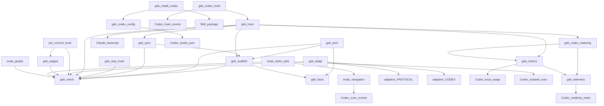

# fugue-docs — 项目索引(L1)

> 本文件是项目的语义相入口。架构变更(模块增删、依赖关系变化、技术栈调整)后必须更新本文件。

## 定位
GEB 分形文档协议的工具集仓库:支持 Claude Code 插件钩子与 Codex 原生 skill / hooks 的协议实现,包含协议文本、架构候选生成器、检查器、脚手架、适配器与硬约束钩子。两种宿主复用自动维护引擎,分别处理工具事件与会话计量;未启用钩子时保留显式维护流程。本仓库自身遵循本协议(吃自己的狗粮),CI 会对自身做同构检查。

## 技术栈
Python 3(≥3.9,零第三方依赖)+ POSIX shell + Markdown。Codex/Claude Code skill 与插件市场分发;`gh`/git 用于发布。Codex 用量账本保存在用户目录,不进入项目仓库。

## 目录结构
```text
fugue-docs/
├── AGENTS.md          # Codex 仓库开发约定与验证入口
├── SKILL.md           # 协议本体(Claude Code / Codex skill 入口)
├── adapters/          # 协议可移植核心(中/英)及 Codex 执行约定
├── agents/            # Codex 技能展示与隐式调用策略
├── assets/            # logo 等静态资源
├── hooks/             # Claude Code 插件钩子登记(无代码)
├── evals/             # 评测包:用例、夹具、评分器、三组试点与安全启动入口 → evals/FOLDER_INDEX.md
├── references/        # 模板、Codex 安装/钩子协议、显式维护与计量说明
└── scripts/           # 全部可执行工具 → scripts/FOLDER_INDEX.md
```

## 模块依赖关系


## 根目录文件
| 文件 | 职责 |
|------|------|
| AGENTS.md | Codex 仓库开发约定与离线验证入口 |
| SKILL.md | 协议本体,Claude Code / Codex skill 定义 |
| README.md / README_EN.md / README_JA.md | 三语说明文档 |
| PROJECT_INDEX.md | 本文件(L1) |
| LICENSE | MIT,含思想来源致谢 |

## 全局约定
- 所有脚本仅用 Python 3 标准库,最低 Python 3.9;CI 覆盖 macOS/Linux 与 3.9/3.14。
- adapters/PROTOCOL.md 是协议核心的单一事实来源;改协议先改它,再同步 SKILL.md。
- 本仓库自身必须通过 `python3 scripts/geb_check.py . --strict`。
